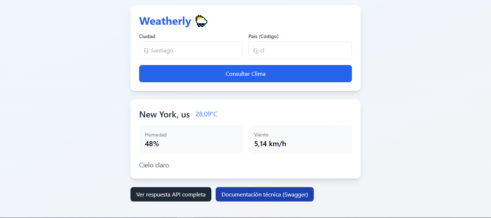
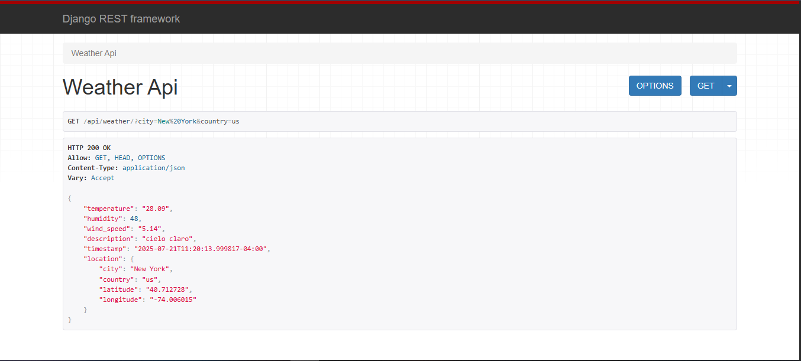
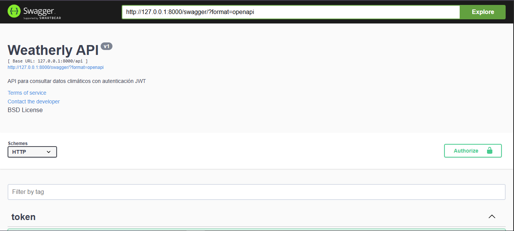

# 🌦️ **Weatherly - API del Clima con Django REST Framework**

[](https://opensource.org/licenses/MIT)
[](https://www.python.org/)
[](https://www.djangoproject.com/)

API RESTful para consultar datos climáticos en tiempo real, con interfaz amigable y documentación Swagger. Desarrollado por [Gabriel Guerra](https://github.com/gaborgr).

<iframe src="https://www.loom.com/embed/d969e2135e70436cb0c2a47d041edc62" frameborder="0" webkitallowfullscreen mozallowfullscreen allowfullscreen></iframe>

  
*(Ejemplo: Interfaz principal con tarjeta de resultados)*

---

## 🚀 **Características**
- **Consulta climática** por ciudad y país.
- **Autenticación JWT** para endpoints protegidos.
- **Documentación interactiva** con Swagger/ReDoc.
- **Frontend integrado** con Tailwind CSS.
- **Caché con Redis** para optimizar llamadas a la API externa.

---

## 🔧 **Tecnologías**
| Tecnología          | Uso                          |
|---------------------|------------------------------|
| Django              | Backend principal            |
| Django REST Framework | API REST                   |
| Tailwind CSS        | Estilos del frontend         |
| Redis              | Caché de datos               |
| OpenWeatherMap     | Datos climáticos             |

---

## 📦 **Instalación**
1. **Clona el repositorio**:
   ```bash
   git clone https://github.com/gaborgr/weatherly-django-rest.git
   cd weatherly-django-rest
   ```

2. **Configura el entorno virtual**:
   ```bash
   python -m venv venv
   source venv/bin/activate  # Linux/Mac
   venv\Scripts\activate     # Windows
   ```

3. **Instala dependencias**:
   ```bash
   pip install -r requirements.txt
   ```

4. **Configura variables de entorno**:
Crea un archivo `.env` en la raíz:
   ```bash
   OPENWEATHER_API_KEY=tu_api_key
   ```

5. **Ejecuta las migraciones**:
   ```bash
   python manage.py migrate
   ```

6. **Inicia el servidor**:
   ```bash
   python manage.py runserver
   ```

---

## 🌐 **Uso**
- **Interfaz web**: Accede a `http://localhost:8000/`
- **API Endpoint**: `GET /api/weather/?city=<nombre>&country=<código>`
- **Documentación**:
  - Swagger: `http://localhost:8000/swagger/`
  - ReDoc: `http://localhost:8000/redoc/`

---

## 📸 **Capturas**
| Sección           | Imagen                      |
|-------------------|----------------------------|
| Interfaz Principal |  |
| Swagger UI        |  |

---

## 🤝 **Contribuciones**
¡Contribuciones son bienvenidas! Sigue estos pasos:
1. Haz un fork del proyecto.
2. Crea una rama (`git checkout -b feature/nueva-funcionalidad`).
3. Haz commit de tus cambios (`git commit -m 'Añade X funcionalidad'`).
4. Haz push a la rama (`git push origin feature/nueva-funcionalidad`).
5. Abre un Pull Request.

---

## 📄 **Licencia**
Este proyecto está bajo la licencia MIT. Ver [LICENSE](LICENSE) para más detalles.
